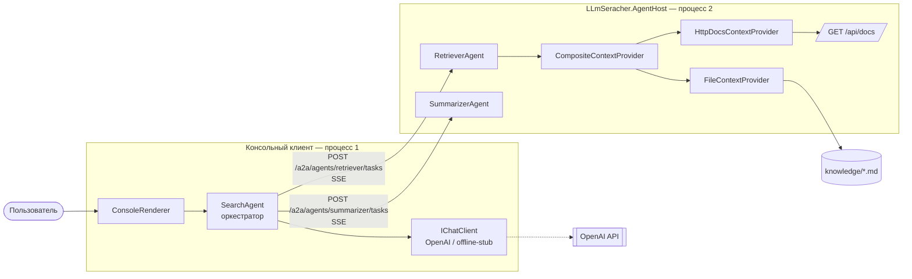
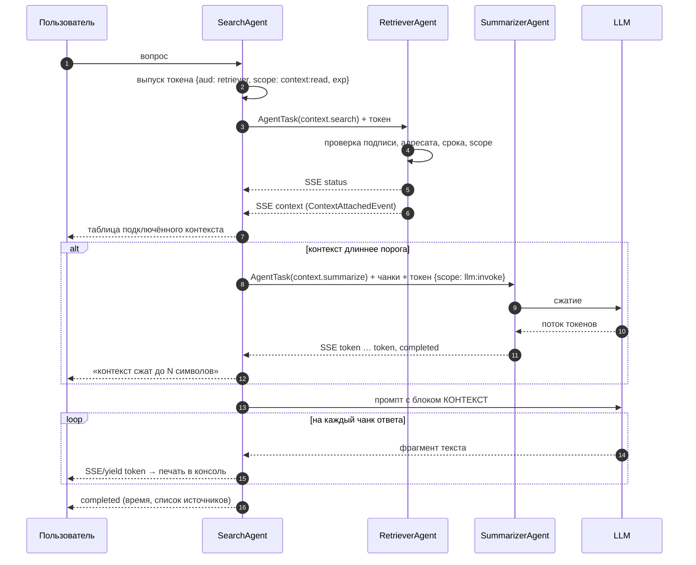

# Архитектура подключения контекста и streaming

## 1. Компоненты



Ключевое свойство: `SearchAgent` не знает, где выполняются остальные агенты. Он работает
с интерфейсом `IAgentClient`, у которого две реализации — `HttpAgentClient` (сеть) и
`InProcessAgentClient` (тот же процесс). Ключ `--local` меняет только регистрацию в DI.

## 2. Сценарий одного запроса



## 3. Подключение контекста

Контракт источника — потоковый, чтобы источник мог отдавать фрагменты по мере готовности:

```csharp
public interface IContextProvider
{
    string Name { get; }
    IAsyncEnumerable<ContextChunk> SearchAsync(string query, int limit, CancellationToken ct);
}
```

| Реализация | Что за источник | Где живёт |
|---|---|---|
| `FileContextProvider` | `knowledge/*.md`, режется по заголовкам `## `, ранжируется по совпадению токенов | хост агентов |
| `HttpDocsContextProvider` | `GET /api/docs?q=&limit=`, ответ читается как поток JSON-элементов | хост агентов |
| `CompositeContextProvider` | опрашивает источники параллельно, дедуплицирует, отдаёт top-N | хост агентов |

Путь контекста в промпт:

1. `RetrieverAgent` собирает `ContextChunk[]` и отдаёт их событием `ContextAttachedEvent`;
2. `SearchAgent` получает чанки **по сети**, не имея доступа к базе знаний;
3. `PromptBuilder.RenderContextBlock` нумерует фрагменты — нумерация единственная и общая
   для промпта, для агента-суммаризатора и для списка источников в консоли;
4. `PromptBuilder.BuildAnswerSystemPrompt` запрещает отвечать вне контекста и требует
   ссылок `[1]`, `[2]`.

Если собранный блок длиннее `Agents:SummarizeThresholdChars`, `SearchAgent` передаёт чанки
`SummarizerAgent` — это и есть передача контекста между агентами. Суммаризатор возвращает
блок в том же формате с теми же номерами, поэтому ссылки в ответе остаются корректными.

## 4. Streaming: четыре участка одной трубы

| Участок | Механизм | Файл |
|---|---|---|
| LLM → агент | `IChatClient.GetStreamingResponseAsync` → `IAsyncEnumerable<ChatResponseUpdate>` | `Agents/SearchAgent.cs` |
| агент → транспорт | `IAsyncEnumerable<AgentEvent>` с `yield return` | `A2A/IAgent.cs` |
| хост → клиент | `TypedResults.ServerSentEvents(IAsyncEnumerable<SseItem<AgentEvent>>)` | `AgentHost/Program.cs` |
| клиент → консоль | `SseParser` + `HttpCompletionOption.ResponseHeadersRead` | `A2A/HttpAgentClient.cs` |

Буферизации нет ни на одном участке: первый токен появляется на экране до того, как модель
дописала ответ. `CancellationToken` протянут насквозь — Ctrl+C в консоли обрывает HTTP-поток,
что обрывает генерацию на хосте.

Формат сообщения в канале:

```
event: token
data: {"type":"token","agentId":"search","text":"14 календарных "}

event: completed
data: {"type":"completed","agentId":"search","text":"…","elapsedMs":4408,"sources":[…]}
```

Типы событий: `status`, `context`, `delegated`, `token`, `completed`, `failed`.
Дискриминатор `type` задаётся атрибутами `[JsonPolymorphic]` / `[JsonDerivedType]` на
`AgentEvent`, поэтому один и тот же C#-тип ездит и в процессе, и по сети.

## 5. A2A: задачи, карточки, полномочия

**Карточка агента** — `GET /a2a/agents/{id}/card`. По ней вызывающая сторона узнаёт навыки
агента и то, какие полномочия придётся делегировать:

```json
{
  "id": "retriever",
  "skills": [{ "id": "context.search", "requiredScopes": ["context:read"] }],
  "protocol": "a2a/1.0",
  "streaming": true
}
```

**Задача** — `POST /a2a/agents/{id}/tasks` с телом `AgentTask`. `ConversationId` сквозной:
по нему связывается вся цепочка делегирований одного вопроса.

**Делегирование (ACP/AP2-lite).** Токен формата
`base64url(payload).base64url(HMAC-SHA256(payload))` несёт: кто делегирует, кому, для какой
задачи, какие полномочия и до какого момента. Получатель проверяет подпись, адресата, срок
и наличие требуемого scope — и только потом выполняет работу.

```csharp
public sealed record DelegationPayload(
    string Issuer, string Audience, string TaskId,
    string ConversationId, IReadOnlyList<string> Scopes, long ExpiresAtUnix);
```

Полномочия узкие и одноразовые: токен на `context:read` не даёт вызвать LLM, токен для
`retriever` не примет `summarizer`, срок жизни — 2 минуты. Проверить поведение:
`dotnet run --project LLmSeracher -- --acl-demo`.

## 6. Конфигурация

| Секция | Ключи |
|---|---|
| `Context` | `KnowledgeRoot`, `MaxChunks`, `MinScore`, `DocsApiBaseUrl` |
| `A2A` | `SelfId`, `HostUrl`, `SigningSecret`, `RequireDelegation` |
| `Agents` | `SummarizeThresholdChars`, `SummaryBudgetChars`, `ContextLimit` |
| `Llm` | `Provider` (auto/openai/fake), `ApiKey`, `Model`, `UtilityModel`, `FakeDelayMs` |

`SigningSecret` общий для всех узлов и лежит в `appsettings.json` только потому, что это
учебный стенд. В реальной системе здесь были бы асимметричные ключи и публикация JWKS,
а сам протокол переехал бы на mTLS.

## 7. Что осознанно упрощено

- поиск по контексту — совпадение токенов с префиксной поблажкой вместо эмбеддингов;
- нет персистентности задач: `AgentTask` живёт в пределах запроса, повторной доставки нет;
- `CompositeContextProvider` ранжирует top-N после опроса всех источников, поэтому
  выдача контекста не потоковая — потоковый здесь только ответ;
- ретраев и circuit breaker нет: недоступный источник просто логируется и пропускается.
