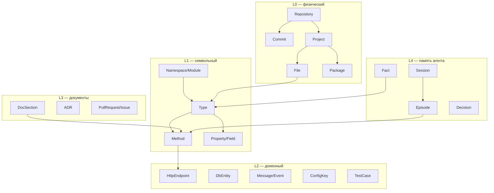
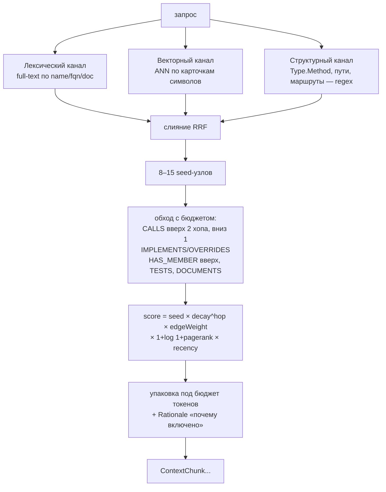

# Графовая БД как источник контекста по коду — анализ

Задача: заменить поиск по `knowledge/*.md` на поиск в графе, построенном по исходному коду
обслуживаемых проектов. Требования — извлечение сущностей и связей и организация
долгосрочного контекста. Основной ЯП индексируемых проектов — C#, дополнительно TS/JS и Python.

Документ отвечает на три вопроса: **какая БД**, **как наполнять и поддерживать актуальность**,
**что менять в коде приложения**.

---

## 0. Что уже есть и что из этого пригодно

| Компонент | Пригодность |
|---|---|
| `IContextProvider` — потоковый контракт источника | **Годен как есть.** Граф встаёт четвёртой реализацией рядом с `FileContextProvider` |
| `ContextChunk` | Годен, но беден: нет пути к файлу, строк, языка, идентификатора символа |
| `CompositeContextProvider` | Требует правки: сравнивает сырые `Score` из разнородных источников |
| `RetrieverAgent`, `SearchAgent`, SSE-конвейер, делегирование | **Не меняются.** Граф прячется за `IContextProvider` |
| `PromptBuilder` | Требует правки: промпт зашит под справку интернет-магазина |
| `AgentHost/Program.cs` | Не меняется — уже итерирует `IEnumerable<IAgent>`, новый агент подхватится сам |

Это главный вывод по существующей архитектуре: абстракции выбраны так, что подключение графа
— аддитивная работа, а не переписывание. Ломающих изменений в A2A-слое не требуется вообще.

---

## 1. Выбор графовой БД

### Критерии, специфичные для этой задачи

1. **.NET-драйвер первого класса** — приложение на .NET 10, сайдкары на других рантаймах нежелательны.
2. **Cypher** — обходы переменной глубины (`*1..3`), фильтры по типам рёбер, пути между узлами.
   На SQL с рекурсивными CTE то же самое пишется в 5–10 раз длиннее и требует ручной борьбы с циклами.
3. **Вектор + полнотекстовый индекс внутри той же БД.** Вход в граф гибридный; отдельный
   векторный стор означает второй источник истины и постоянную рассинхронизацию с графом.
4. **Дешёвые точечные апдейты** — переиндексация идёт покоммитно, десятки раз в день.
5. **Масштаб.** Репозиторий на 5 000 файлов C# → ~150 тыс. узлов, ~1.5 млн рёбер.
   Монорепа → до 10 млн рёбер. Это **мало** для любого кандидата; масштаб не является
   разделяющим критерием, и оптимизировать под него не нужно.
6. Локальный запуск без тяжёлой инфраструктуры (режим `--local` должен остаться воспроизводимым).

### Кандидаты

| БД | .NET-клиент | Язык запросов | Вектор + FTS внутри | Развёртывание | Лицензия | Вердикт |
|---|---|---|---|---|---|---|
| **Neo4j** | `Neo4j.Driver` **6.3.0** (июль 2026), первая сторона, net8+/net10, 4.9 млн загрузок | Cypher (GQL-совместимый) | Да: vector index (HNSW) + full-text (Lucene) | Docker, ~2 ГБ RAM | GPLv3 (CE) / коммерческая (EE) | **Основной выбор** |
| **Memgraph** | тот же `Neo4j.Driver` — Bolt-совместим | openCypher | Да | Docker, in-memory (RAM ≈ размер графа) | BSL 1.1 → Apache 2.0 | Запасной: если упрёмся в latency обходов |
| **FalkorDB** | `NFalkorDB` — официальный, поверх `StackExchange.Redis` | openCypher | Да | Docker, Redis-модуль, самый лёгкий | собственная | Запасной: минимум инфраструктуры |
| **Kùzu / LadybugDB** | **нет биндинга** (только P/Invoke к C API) | Cypher | Да | embedded, ноль инфраструктуры | MIT | **Не брать сейчас** — см. ниже |
| **PostgreSQL + Apache AGE + pgvector** | `Npgsql` | Cypher внутри SQL | pgvector + tsvector | один Postgres | Apache 2.0 | Разумно, если Postgres уже в стеке |
| ArangoDB / Neptune / Cosmos Gremlin | community / cloud SDK | AQL / Gremlin | частично | — | BSL / cloud | Преимуществ для задачи не дают |

### Почему не Kùzu, хотя embedded здесь очень соблазнителен

Встраиваемая графовая БД сняла бы Docker с разработчика и сохранила бы режим `--local` без
внешних сервисов — это ровно то, чего хочется. Но:

- оригинальный репозиторий **заархивирован 10 октября 2025** после покупки Kùzu Inc. компанией Apple;
- сообщество разошлось на несколько форков — LadybugDB, bighorn (Kineviz), Vela-Engineering/kuzu;
  ни один пока не набрал репутации «безопасного выбора»;
- **.NET-биндинга нет ни у одного форка** (Python, Node, Rust, Go, Swift, Java, C/C++) —
  пришлось бы писать и сопровождать P/Invoke-обёртку над C API.

Возвращаться к этому варианту стоит, когда у LadybugDB появится стабильный .NET-биндинг:
для однопользовательского инструмента разработчика embedded-модель объективно лучше.

### Рекомендация

**Neo4j** как основная БД, за интерфейсом `IGraphStore`. Cypher у Neo4j, Memgraph и FalkorDB
совместим почти дословно, а Memgraph говорит по тому же Bolt-протоколу — переезд на любой
из запасных вариантов стоит замены строки подключения и нескольких запросов, а не переписывания.

Postgres + AGE — единственная реальная альтернатива по существу, а не по вкусу: если у вас
уже эксплуатируется Postgres, вариант «один сервер, pgvector и граф в одном месте, Apache 2.0»
весит много. Расплата — эргономика Cypher-внутри-SQL и заметно более слабые глубокие обходы.

**Чего графовая БД не заменяет.** Вектора остаются нужны для входа в граф по описательному
запросу. Граф отвечает на «кто это вызывает», «что сломается», «где реализация интерфейса» —
на такие вопросы векторный поиск не отвечает в принципе, ни при каком качестве эмбеддингов.
Ценность в связке, а не в замене одного другим.

---

## 2. Модель графа

### Слои



Слои L0–L1 извлекаются детерминированно из компилятора, L2 — эвристиками по атрибутам и
маршрутам, L3 — из markdown и VCS, L4 — из работы самого агента. Разделение важно: у слоёв
разная точность и разная частота обновления, и смешивать их в ранжировании нельзя.

### Рёбра

**Структурные** (точность ~100 %, дёшево):
`(:Project)-[:CONTAINS]->(:File)`, `(:File)-[:DECLARES]->(:Type|:Method)`,
`(:Type)-[:HAS_MEMBER]->(:Method|:Property|:Field)`, `(:Project)-[:REFERENCES]->(:Project|:Package)`

**Типовые:**
`(:Type)-[:INHERITS]->(:Type)`, `[:IMPLEMENTS]`, `(:Method)-[:OVERRIDES]->(:Method)`,
`[:IMPLEMENTS_MEMBER]`, `(:Method)-[:RETURNS]->(:Type)`, `[:HAS_PARAM {pos,name}]->(:Type)`

**Потоковые — основная ценность:**
`(:Method)-[:CALLS {file,line,viaInterface}]->(:Method)`, `[:READS|WRITES]->(:Field|:Property)`,
`[:INSTANTIATES]->(:Type)`, `[:THROWS]->(:Type)`

**DI-специфика C# — критично, легко упустить:**

```
(:Type)-[:REGISTERED_AS {lifetime:"singleton"}]->(:Type)   ← из AddSingleton<TService,TImpl>()
```

Без этих рёбер граф вызовов рвётся на каждом интерфейсе. Ваш собственный код — точная
иллюстрация: `SearchAgent` вызывает `IContextProvider.SearchAsync`, а исполняется
`CompositeContextProvider`, который дальше зовёт `FileContextProvider` и `HttpDocsContextProvider`.
Чисто синтаксически связь `SearchAgent → FileContextProvider` не выводится ни при каком анализе
вызовов — она существует только в `ServiceCollectionExtensions.AddContextSources()`.
Экстрактор регистраций DI обязателен, а при обходе `CALLS` в интерфейсный метод нужно
дополнительно раскрывать `IMPLEMENTS_MEMBER` в обратную сторону.

**Исторические (из git):**
`(:Commit)-[:TOUCHES]->(:File)`, `(:Commit)-[:AUTHORED_BY]->(:Person)`,
производное `(:File)-[:CO_CHANGED {count,lastAt}]-(:File)`.
Со-изменяемость даёт связи, которых нет в AST: `appsettings.json` ↔ `ContextOptions.cs`,
клиент ↔ сервер, код ↔ его миграция. Дёшево считается и заметно улучшает выдачу.

**Документные:** `(:DocSection)-[:DOCUMENTS]->(:Type|:Method)` — по `<see cref>` в XML-doc
и по упоминанию идентификаторов в markdown.

### Узел-символ

```
id            "csharp::M:LLmSeracher.Core.Context.CompositeContextProvider.SearchAsync(System.String,System.Int32,System.Threading.CancellationToken)"
kind          Method | Type | Property | Field | ExternalSymbol
name / fqn    "SearchAsync" / "LLmSeracher.Core.Context.CompositeContextProvider.SearchAsync"
signature     "public async IAsyncEnumerable<ContextChunk> SearchAsync(string query, int limit, CancellationToken ct)"
language      "csharp"
filePath      "LLmSeracher.Core/Context/CompositeContextProvider.cs"
startLine / endLine   24 / 62
docComment    XML-doc символа
bodyHash      sha256 тела  ← инкрементальность и решение «пересчитывать ли эмбеддинг»
summary       LLM-саммари, лениво
embedding     float[1536]
sourceFile    файл, при разборе которого узел порождён  ← ключ инкрементального удаления
visibility, isStatic, isAbstract, isTest, confidence
commitSha, updatedAt
```

Индексы, без которых работать не будет:
уникальный constraint на `(:Symbol {id})` (иначе `MERGE` деградирует в полный скан),
full-text по `name, fqn, docComment, summary`, vector по `embedding`, обычный по `sourceFile`.

**Правило против взрыва графа:** узел заводится только если на него можно осмысленно сослаться
в ответе. Локальные переменные, литералы, отдельные выражения в граф не идут никогда.

---

## 3. Извлечение сущностей и связей

### C# — Roslyn, альтернатив нет

`Microsoft.CodeAnalysis.CSharp.Workspaces` **5.6.0** (июль 2026, net8+/netstandard2.0, работает
на net10) + `Microsoft.Build.Locator` + `MSBuildWorkspace.OpenSolutionAsync`.
То, что индексатор — тоже .NET, здесь крупное преимущество: компилятор работает in-process,
без сайдкаров и промежуточных форматов.

Схема прохода: по каждому проекту — `Compilation`, по каждому документу — `SyntaxTree` и
`SemanticModel`; `CSharpSyntaxWalker` по дереву; на каждом `InvocationExpressionSyntax` —
`semanticModel.GetSymbolInfo(node).Symbol` → `IMethodSymbol` → ребро `CALLS`.

**Идентичность узла — `ISymbol.GetDocumentationCommentId()`.** Даёт строку вида
`M:Ns.Type.Method(System.String)`: стабильна между сборками, не зависит от форматирования,
переживает перемещение файла и переименование проекта. Это и есть ключ `MERGE`.
Оговорки: у локальных функций и лямбд идентификатора нет — синтезировать
`{родитель}+local:{имя}#{порядковый}` либо не индексировать; дженерики приходят
в нотации `` `1 `` и годятся как есть.

Что легко упустить:

- `symbol.ContainingAssembly` отделяет свой код от NuGet-символов. Внешние заводить как
  `:ExternalSymbol` с `package` — без тела, но с рёбрами. Это сразу даёт ответы вида
  «где мы используем `IChatClient.GetStreamingResponseAsync`».
- **Проверять `Compilation.GetDiagnostics()`.** Если проект не восстановлен (`dotnet restore`),
  `SemanticModel` молча деградирует и половина рёбер `CALLS` просто не появится, а индексатор
  отработает «успешно». Индексатор обязан падать или громко предупреждать на `CS0246`.
- `SymbolFinder.FindReferencesAsync` удобен, но дорог при полном обходе. На full index дешевле
  идти от вызова к определению одним проходом; `FindReferences` оставить интерактивным запросам.
- Экстрактор регистраций DI (`AddSingleton/AddScoped/AddTransient` с generic-аргументами) —
  отдельный проход, см. раздел 2.

### TypeScript / JavaScript

Два пути: свой Node-сайдкар на TS Compiler API / `ts-morph` либо **`scip-typescript`**
(индексатор Sourcegraph поверх тайпчекера TS) с разбором SCIP-protobuf в .NET через
`Google.Protobuf`. Рекомендую второй: чужая реализация, проверенная на масштабе, и тот же
парсер SCIP затем переиспользуется для Python — то есть одна интеграция вместо двух.

Особенность SCIP: он даёт `definitions` / `references` / `relationships`, но не даёт `CALLS`
напрямую. Рёбра вызова восстанавливаются стандартным приёмом — «ссылка, попадающая в диапазон
строк определения метода X, указывающая на определение метода Y» ⇒ `X CALLS Y`.

### Python

`scip-python` (на базе pyright), тот же конвейер. Но динамика языка ставит потолок точности:
надёжны `IMPORTS`, `DECLARES`, `INHERITS`; `CALLS` — с оговоркой, pyright не разрешает
`getattr`, monkey-patching и DI-контейнеры.

Дешёвый fallback для обоих второстепенных языков — tree-sitter: только `DECLARES` / `IMPORTS` /
`CALLS_BY_NAME` (по имени, без разрешения). Этого хватает на «где определена функция X».

**Механизм, который защищает основной язык:** свойство `confidence` на ребре
(C#/Roslyn — 1.0, scip-typescript — 0.9, scip-python — 0.7, tree-sitter — 0.4) и фильтр
`WHERE r.confidence >= 0.8` в точных запросах. Так неточность второстепенных языков не портит
выдачу по C#, и «пренебречь» ими можно не выкидыванием, а порогом.

### Кросс-языковые связи — то, ради чего стоит держать все три языка

```
(:TsFunction)-[:CALLS_HTTP]->(:HttpEndpoint)<-[:HANDLES]-(:CsMethod)
```

Маршрут берётся из `[HttpGet("/api/docs")]` либо из minimal API (`app.MapGet("/api/docs", …)`)
с одной стороны и из строковых литералов `fetch`/`axios` — с другой. Ни один языковой
индексатор такую связь не даёт, а на практике она самая востребованная: «кто на фронте
дёргает этот эндпоинт». Стоит отдельного небольшого экстрактора.

---

## 4. Наполнение и поддержание актуальности

```
git → Discover(изменённые файлы) → Extract → Normalize(Node/Edge DTO)
    → Upsert(граф) → Embed(асинхронно) → Derive(PageRank, CO_CHANGED)
```

### Владение рёбрами — основа инкрементальности

Каждый узел и каждое ребро несут `sourceFile` — файл, при разборе которого они порождены.
Тогда обновление файла `F` детерминированно и не требует диффа графа:

```cypher
// 1. снести всё, что порождено этим файлом
MATCH ()-[r {sourceFile: $f}]->() DELETE r;

// 2. записать заново
UNWIND $nodes AS n
  MERGE (s:Symbol {id: n.id}) SET s += n.props, s.sourceFile = $f;
UNWIND $edges AS e
  MATCH (a:Symbol {id: e.from}), (b:Symbol {id: e.to})
  MERGE (a)-[r:CALLS {sourceFile: $f}]->(b) SET r += e.props;

// 3. подчистить осиротевшие
MATCH (n:Symbol {sourceFile: $f}) WHERE NOT (n)--() DETACH DELETE n;
```

Тонкость, которую легко сделать неправильно: символ, объявленный в `F`, может быть **целью**
ребра из файла `G`. Поэтому удаляются только рёбра, **порождённые** `F`, а узлы — лишь
оставшиеся без связей.

### Радиус переиндексации

| Изменилось | Переразбирать |
|---|---|
| `.cs` | проект целиком (partial-классы, extension-методы, вывод типов); в граф писать дельту по `bodyHash` |
| `.csproj`, `Directory.Packages.props` | проект + все ссылающиеся на него |
| `.ts` | файл + его импортёры (модульность TS строже) |
| `.py` | файл + импортёры, с поправкой на низкую `confidence` |
| `*.md` | только документные рёбра |

Дороже всего C#: Roslyn всё равно строит `Compilation` на проект, поштучно файл не пересобрать.
На типичном проекте это единицы секунд — приемлемо.

### Триггеры

1. **CI на push в main — источник истины.** Джоб `index --since $BEFORE_SHA --to $AFTER_SHA`,
   по завершении обновляется `(:Repository {headSha})`.
2. **Локальный watcher** (`FileSystemWatcher` + debounce ~500 мс) для рабочей копии, пишет
   в отдельную ветку графа (`branch: "feature/x"`), чтобы не портить main.
3. **Ночная полная сверка** — обход с сравнением `bodyHash`, лечит дрейф от пропущенных
   вебхуков и упавших джоб. Количество расхождений за ночь — и есть метрика здоровья пайплайна,
   её стоит логировать с первого дня.

### Версионирование

Снапшот на коммит не делать — объём взрывается, а спрос почти нулевой. Граф хранит состояние
HEAD ветки; история живёт отдельным слоем `(:Commit)`. Вопросы «как было в релизе 1.2»
решаются разовым `git worktree` + временный граф, а не постоянным версионированием.

### Эмбеддинги

- Эмбеддится **карточка символа** — сигнатура + XML-doc + первые N строк тела + путь.
  Голое тело шумит и даёт худший recall, чем карточка.
- Пересчёт только при смене `bodyHash`.
- Очередь: индексатор ставит `embeddingStale: true`, фоновый воркер добирает батчами по 100
  через `IEmbeddingGenerator<string, Embedding<float>>` из `Microsoft.Extensions.AI` —
  пакет у вас уже подключён.
- Офлайн-режим: детерминированный хеш-эмбеддинг по образцу `FakeChatClient`, чтобы `--demo`
  и `--local` остались воспроизводимыми без ключа OpenAI.

### Порядок стоимости

Репозиторий 5 000 файлов C#: полный проход Roslyn — минуты, ~150 тыс. узлов / ~1.5 млн рёбер,
1–2 ГБ в Neo4j вместе с векторами, эмбеддинги на `text-embedding-3-small` — единицы долларов
разово. Инкремент на коммит — секунды. Ни одна из цифр не является ограничением.

---

## 5. Как устроен поиск



Три канала входа нужны потому, что запросы бывают трёх разных природ: «где `SearchAsync`»
(лексика), «как устроено сжатие контекста» (вектора), «что вызывает
`CompositeContextProvider.SearchAsync`» (точное попадание в символ). Слияние — Reciprocal Rank
Fusion, а не взвешенная сумма: косинусная близость и BM25 несравнимы по шкале, складывать их
напрямую некорректно.

**Обратные `CALLS` важнее прямых.** Вопросы «что сломается, если поменять X» и «как этим
пользуются» — это callers, и векторный поиск их не находит никогда. Это и есть главный
практический выигрыш графа.

Пример — анализ влияния:

```cypher
MATCH (s:Symbol {id: $symbolId})
MATCH p = (s)<-[:CALLS|IMPLEMENTS_MEMBER*1..3]-(c:Symbol)
WHERE ALL(r IN relationships(p) WHERE r.confidence >= 0.8)
OPTIONAL MATCH (t:Symbol {isTest: true})-[:TESTS]->(c)
RETURN c.fqn, c.filePath, c.startLine, length(p) AS hops, collect(t.fqn) AS tests
ORDER BY hops, c.pagerank DESC LIMIT 40
```

**Агентный режим** (дороже, но качественнее): дать модели инструменты вместо одного
фиксированного запроса — `find_symbol`, `neighbors(symbolId, edgeTypes, depth)`,
`read_symbol`, `path_between(a,b)`, `impact(symbolId)` — и позволить самой решать, куда
расширяться. Это буквально ваша A2A-модель: отдельный агент с навыками и scope `graph:read`.
Разумный компромисс — одиночный запрос по умолчанию, агентный обход по флагу или при низкой
уверенности seed-узлов.

---

## 6. Долгосрочный контекст

Память живёт **в том же графе**, иначе её невозможно связать с кодом:

```
(:Session)-[:HAS]->(:Episode {query, answer, ts})
(:Episode)-[:MENTIONS]->(:Symbol)
(:Fact {statement, confidence, validFrom, validTo, observedAt})-[:ABOUT]->(:Symbol)
(:Decision {title, rationale})-[:AFFECTS]->(:Symbol)
(:Preference {scope:"user|project", statement})
```

**Битемпоральность** (подход Graphiti/Zep): у факта есть `validFrom`/`validTo` — когда он верен
в мире, и `observedAt` — когда мы о нём узнали. Новый противоречащий факт не удаляет старый,
а закрывает его `validTo`. Так сохраняется ответ на «почему мы так решили в марте» и не теряется
аудит.

**Инвалидация памяти кодом — главный аргумент за единый граф.** Если `Fact` привязан к
`Symbol`, а у символа сменился `bodyHash`, факт помечается `needsRevalidation: true`.
Иначе после первого же рефакторинга долговременная память начинает уверенно врать —
а это заметно хуже, чем её отсутствие.

Гигиена: дедупликация фактов по эмбеддингу (порог ~0.95), TTL на эпизоды, ночная консолидация
«несколько эпизодов → один факт».

---

## 7. Изменения в коде приложения

### Новые проекты

```
LLmSeracher.Graph/
  Schema/          NodeKinds.cs, EdgeKinds.cs, SymbolId.cs
  IGraphStore.cs                    Upsert / DeleteBySourceFile / Query
  Neo4jGraphStore.cs
  Retrieval/       GraphRetriever.cs (seed → expand → rank → pack), RankingOptions.cs
LLmSeracher.Indexer/
  Extractors/      CSharpRoslynExtractor.cs, DiRegistrationExtractor.cs,
                   ScipExtractor.cs (TS + Python), GitHistoryExtractor.cs, HttpRouteExtractor.cs
  Pipeline/        IndexPipeline.cs, ChangeSet.cs, EmbeddingWorker.cs
  Program.cs                        index --repo . --full | --since <sha> | --watch
```

### Правки существующего

**`LLmSeracher.Core/Context/ContextChunk.cs`** — расширить, ничего не ломая. Все новые
свойства опциональны, поэтому JSON-контракт A2A остаётся совместимым:

```csharp
public sealed record ContextChunk(
    string SourceId, string DocumentId, string Title, string Text, double Score)
{
    public string Key => $"{SourceId}/{DocumentId}";

    public string? Language  { get; init; }   // "csharp"
    public string? FilePath  { get; init; }
    public int?    StartLine { get; init; }
    public int?    EndLine   { get; init; }
    public string? SymbolId  { get; init; }
    public string? Kind      { get; init; }   // Method | Type | Doc | Fact
    public string? Rationale { get; init; }   // "← вызывается из SearchAgent.ExecuteAsync"
}
```

`Rationale` — не украшение. Это то, что делает графовый retrieval объяснимым: оно попадает
в промпт и в консольную таблицу источников, и по нему видно, почему фрагмент вообще подключён.

**`Context/GraphContextProvider.cs`** (новый) — реализует существующий `IContextProvider`,
регистрируется в `AddContextSources()` рядом с файловым. На первом этапе оба работают
параллельно — это даёт честное сравнение выдачи.

**`ServiceCollectionExtensions.AddContextSources()`** — добавить `GraphContextProvider`,
`IGraphStore`, `IEmbeddingGenerator`; состав источников сделать конфигурируемым
(`Context:Sources: ["graph","files"]`): для кодовых репозиториев файловый источник только шумит.

**`CompositeContextProvider`** — заменить `OrderByDescending(c => c.Score)` на RRF.
Сейчас в одной сортировке сравниваются токенный скор файлов и косинус графа; после подключения
графа это станет источником систематически плохой выдачи. Заодно у `MinScore` перестаёт быть
единый смысл — порог должен уехать внутрь источника.

**`PromptBuilder`** — вынести профили: `IPromptProfile` с реализациями `SupportProfile`
(текущая, про магазин «Орбита») и `CodeProfile`. Кодовый профиль:
рендер фрагмента как ```` ```csharp ```` с комментарием `// path/File.cs:24-62`;
требование цитировать `файл:строка`, а не только `[1]`;
и отдельный раздел «граф» в блоке контекста — список рёбер между включёнными символами.
Последнее стоит дёшево и заметно поднимает качество: модель видит структуру, а не мешок фрагментов.

**`ContextOptions`** — `MaxChunks = 4` для кода мало. Ввести `MaxContextTokens`, `MaxHops`,
`EdgeWeights`, `MinConfidence`.

### Новые агенты — в существующем A2A-стиле

| Агент | Навыки | Scope |
|---|---|---|
| `GraphNavigatorAgent` | `code.symbol.find`, `code.neighbors`, `code.impact`, `code.path` | `graph:read` |
| `MemoryAgent` | `memory.recall`, `memory.write` | `memory:read`, `memory:write` |
| `IndexerAgent` (опционально) | `code.reindex` | `graph:write` |

Разделение `memory:read` / `memory:write` здесь содержательно: запись в долговременную память —
привилегия, и ваша модель делегирования уже умеет её выражать. Регистрируются в
`AddHostedAgents()`; `AgentHost/Program.cs` подхватит их без правок.

### Конфигурация

```json
"Graph":    { "Provider": "neo4j", "Uri": "bolt://localhost:7687", "User": "neo4j", "Database": "code" },
"Indexer":  { "Repositories": [ { "Path": "C:/Projects/X", "Branch": "main",
                                  "Languages": ["csharp","typescript"] } ],
              "WatchMode": false, "EmbeddingModel": "text-embedding-3-small" },
"Retrieval":{ "SeedLimit": 12, "MaxHops": 2, "MaxContextTokens": 12000, "MinConfidence": 0.8,
              "EdgeWeights": { "CALLS": 1.0, "IMPLEMENTS": 0.8, "TESTS": 0.9, "CO_CHANGED": 0.4 } }
```

### Что не меняется

`SearchAgent`, `RetrieverAgent`, `HttpAgentClient`, `InProcessAgentClient`, `AgentStream`,
`Delegation`, SSE-конвейер, `AgentHost/Program.cs`, режимы `--local` и `--demo`.

---

## 8. Порядок внедрения

| Этап | Содержание | Что начинает работать |
|---|---|---|
| **1. Каркас** | Neo4j в docker-compose, `IGraphStore`, схема + constraints, Roslyn-экстрактор `File/Type/Method` + `DECLARES/HAS_MEMBER/CALLS`, `index --full`, `GraphContextProvider` с лексическим каналом | «где определено», «кто вызывает» |
| **2. Гибрид** | эмбеддинги, vector index, RRF, ранжирование с decay, `Rationale`, `CodeProfile` | описательные вопросы по коду |
| **3. Актуальность** | `--since <sha>`, владение рёбрами, CI-джоб, ночная сверка, git-слой и `CO_CHANGED` | граф перестаёт устаревать |
| **4. Агентность** | `GraphNavigatorAgent` с инструментами, `MemoryAgent`, битемпоральные факты | многошаговые вопросы, долгая память |
| **5. Второстепенные ЯП** | парсер SCIP, `scip-typescript`, `scip-python`, `confidence`, кросс-язык HTTP | TS/Python, связи фронт↔бэк |

Порядок существенен: если отложить этап 3, через пару недель система начнёт уверенно отвечать
по устаревшему графу — а это хуже, чем отсутствие графа.

---

## 9. Риски

| Риск | Как проявится | Что делать |
|---|---|---|
| **DI разрывает граф вызовов** | ответы не связывают интерфейс с реализацией | экстрактор `REGISTERED_AS` + раскрытие `IMPLEMENTS_MEMBER` при обходе — с первого этапа |
| **Непроведённый `restore`** | Roslyn молча теряет половину рёбер, индексатор «успешен» | проверка `GetDiagnostics()`, отказ индексировать при `CS0246` |
| **Дрейф графа** | тихая деградация качества, никто не замечает | ночная полная сверка + метрика расхождений в логах |
| **Соблазн индексировать всё** | взрыв рёбер, деградация обходов | правило: узел заводится, только если на него можно сослаться в ответе |
| **Память врёт после рефакторинга** | старые факты о переписанном коде | `needsRevalidation` по смене `bodyHash` |
| **Лицензия Neo4j CE (GPLv3)** | ограничения при поставке продукта заказчику | для внутреннего инструмента нормально; иначе Memgraph / FalkorDB / AGE |
| **Windows-окружение** | Neo4j и Memgraph — только через Docker Desktop | принять; embedded-вариант вернуть к рассмотрению, когда у LadybugDB появится .NET-биндинг |

---

## 10. Что из этого реализовано

Этапы 1–2 выполнены и проверены на этой же кодовой базе. Инструкции — в [README](README.md#граф-кода).

**Сделано:**

| Компонент | Где |
|---|---|
| Neo4j 2026.06 в docker-compose | [docker-compose.yml](docker-compose.yml) |
| Схема, constraints, полнотекстовый индекс, индексы по свойствам рёбер | [Neo4jGraphStore.cs](LLmSeracher.Graph/Neo4jGraphStore.cs) |
| Экстрактор C# на Roslyn: типы, методы, свойства, поля, точки входа top-level | [CSharpExtractor.cs](LLmSeracher.Indexer/Extraction/CSharpExtractor.cs) |
| Рёбра CONTAINS, DECLARES, HAS_MEMBER, REFERENCES, INHERITS, IMPLEMENTS, IMPLEMENTS_MEMBER, OVERRIDES, CALLS, INSTANTIATES, RETURNS, HAS_PARAM, **REGISTERED_AS** | там же |
| Инкрементальность через владение рёбрами (`sourceFile`) | [Neo4jGraphStore.DeleteBySourceFilesAsync](LLmSeracher.Graph/Neo4jGraphStore.cs) |
| Поиск: структурный + полнотекстовый каналы, слияние RRF, обход с затуханием, диверсификация по файлам | [GraphRetriever.cs](LLmSeracher.Graph/Retrieval/GraphRetriever.cs) |
| Определение намерения запроса (callers / implementations) | [QueryAnalyzer.cs](LLmSeracher.Graph/Retrieval/QueryAnalyzer.cs) |
| `GraphContextProvider` за существующим `IContextProvider` | [GraphContextProvider.cs](LLmSeracher.Graph/GraphContextProvider.cs) |
| Кодовый профиль промпта, `Rationale`, цитирование `файл:строка` | [PromptBuilder.cs](LLmSeracher.Core/Agents/PromptBuilder.cs) |
| RRF вместо сравнения сырых скоров в композите | [CompositeContextProvider.cs](LLmSeracher.Core/Context/CompositeContextProvider.cs) |

Результат на этом репозитории: 5 проектов, 44 файла → **962 узла, 2697 рёбер**, полная индексация ~10 с,
повторный прогон идемпотентен (счётчики не меняются), запрос к графу — 230–460 мс.

**Не сделано (по этапам из раздела 8):**

- **Векторный канал (этап 2).** Точки входа ищутся только текстом. Практическое следствие
  измерено: запросы, у которых лексика совпадает с идентификаторами и русскими XML-комментариями
  («проверка подписи делегирующего токена» → `DelegationService`, `DelegationPayload`), работают
  хорошо; запрос, где понятие названо по-русски, а в коде оно по-английски («потоковая передача
  токенов» ↔ `TokenEvent`, `GetStreamingResponseAsync`), не работает. Это ровно тот разрыв,
  который закрывают эмбеддинги, и никакой настройкой Lucene он не закрывается.
- **Этап 3:** `--since <sha>`, CI-джоб, ночная сверка, git-слой и `CO_CHANGED`. Механика
  инкрементального обновления готова и работает, не хватает только триггеров поверх неё.
- **Этап 4:** `GraphNavigatorAgent`, `MemoryAgent`, битемпоральные факты — долгосрочная память
  не реализована вовсе.
- **Этап 5:** TS/JS и Python. Схема графа и свойство `confidence` предусмотрены, экстракторов нет.

**Что показала проверка с живой моделью** (`qwen-36-think` через OpenAI-совместимый API).
Демо из трёх вопросов проходит за ~50 с, ответы точные, со ссылками вида `файл:строка`.
Четыре дефекта, которых на оффлайн-заглушке не было видно:

1. **Фигурные скобки в потоке роняли консоль.** `AnsiConsole.Write(string)` разбирает
   аргумент как шаблон форматирования, и первый же процитированный моделью
   `$"нет полномочия '{scope}'"` давал `FormatException` посреди ответа. На markdown-справке
   это не проявлялось никогда — скобки бывают только в коде.
2. **Суммаризатор ломает нумерацию источников.** Инвариант «сжатый блок сохраняет номера»
   держался на инструкции в промпте; живая модель её нарушает, и ответ получает верные факты
   с неверными ссылками. Добавлена проверка привязки «номер → заголовок» с откатом
   на полный контекст. Структурно надёжнее сжимать фрагменты поштучно — тогда нумерация
   сохраняется по построению, но это меняет контракт агента.
3. **Устаревший граф проявился как неверные номера строк** в ответе: индексация отставала
   от рабочего дерева на несколько правок. Ровно то, о чём раздел 4, — и в отсутствие
   этапа 3 это ничем не отлавливается, кроме ручного `index`.
4. **Ранжирование членов типа.** Узел типа по построению содержит только сигнатуры, поэтому
   тип в выдаче без своих методов бесполезен; а когда члены подтягивались, все они получали
   одинаковый вес, и в контекст попадал приватный хелпер `Sign` вместо публичного `Validate`.
   Введены `TypeMemberWeight` и предпочтение публичной части.

**Где проверка упёрлась в предел.** Вопрос «где проверяется подпись токена» находит тип
`DelegationService`, но выбрать между его методами `Validate` и `Issue` лексический канал
не может: ни один не совпадает с запросом ни по имени, ни по комментарию, и они получают
равные веса. Это не настраивается весами — нужна семантика, то есть тот самый векторный
канал. Поэтому все три вопроса демо называют символ явно.

**Что показала проверка на собственном коде** — три дефекта, которых иначе бы не увидели:

1. Фабричные регистрации DI разбирались неверно: в `AddSingleton<IContextProvider>(sp => …)`
   первым в теле фабрики встречается `GetRequiredService<IOptions<…>>`, и реализацией
   оказывался `IOptions`. Исправлено приоритетом `new X(...)` над резолвом контейнера.
2. Полное имя каждого члена содержит имя своего типа, поэтому текстовый запрос «что делает
   FooProvider» вытягивал в выдачу весь тип целиком — конструктор, поля, свойства — и вытеснял
   тех, кто этот тип вызывает. Исправлено ограничением числа фрагментов на файл.
3. Оффлайн-заглушка LLM определяла свою роль поиском подстроки «агент-суммаризатор» по всему
   системному промпту. Как только граф отдал в контекст фрагмент `PromptBuilder`, маркер нашёлся
   внутри чужого кода, и заглушка стала сжимать вопрос вместо ответа на него. Исправлено
   проверкой префикса промпта.

Третий дефект — общая проблема любого RAG по коду, а не частность заглушки: подключённый
контекст попадает в то же сообщение, что и инструкции, и любая логика, ищущая маркеры по всему
промпту, ломается о содержимое найденных фрагментов.

## Источники

- [Neo4j.Driver на NuGet](https://www.nuget.org/packages/Neo4j.Driver) — 6.3.0, 22.07.2026, net8+
- [Vector indexes — Cypher Manual](https://neo4j.com/docs/cypher-manual/current/indexes/semantic-indexes/vector-indexes/)
- [Memgraph](https://github.com/memgraph/memgraph) и [лицензия BSL 1.1](https://github.com/memgraph/memgraph/blob/master/licenses/BSL.txt)
- [FalkorDB](https://github.com/FalkorDB/FalkorDB), [NFalkorDB — официальный .NET-клиент](https://github.com/FalkorDB/NFalkorDB)
- [KuzuDB abandoned, community mulls options — The Register, 14.10.2025](https://www.theregister.com/2025/10/14/kuzudb_abandoned/)
- [From Kuzu to Ladybug — The Data Quarry](https://thedataquarry.com/blog/from-kuzu-to-ladybug/), [LadybugDB](https://ladybugdb.com/)
- [Apache AGE — roadmap и поддержка PG17/PG18](https://github.com/apache/age/discussions/2305)
- [Microsoft.CodeAnalysis.CSharp.Workspaces на NuGet](https://www.nuget.org/packages/Microsoft.CodeAnalysis.CSharp.Workspaces) — 5.6.0, 02.07.2026
- [Roslyn Integration and Symbol Extraction (docfx)](https://deepwiki.com/dotnet/docfx/7.2-roslyn-integration-and-symbol-extraction)
- [scip-dotnet](https://github.com/sourcegraph/scip-dotnet), [scip-typescript](https://github.com/sourcegraph/scip-typescript), [scip-python](https://github.com/sourcegraph/scip-python)
- [SCIP — формат индексов кода](https://sourcegraph.com/blog/announcing-scip)
- Прототипы того же класса: [stakgraph](https://github.com/stakwork/stakgraph) (tree-sitter + LSP + Neo4j), [code-graph-rag](https://github.com/vitali87/code-graph-rag) (Memgraph), [FalkorDB code-graph](https://www.falkordb.com/blog/code-graph-is-the-secret/)
