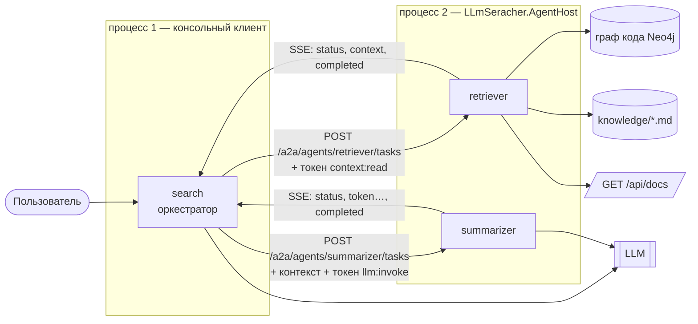

# ДЗ 9, 11. Сеть агентов, связанных A2A, гибридный поиск в графовой БД

Три агента, разнесённые по двум процессам, решают один вопрос пользователя: один владеет
контекстом, второй сжимает его, третий оркеструет и отвечает. Между собой они общаются по
A2A: задача уходит HTTP-запросом, результат возвращается потоком Server-Sent Events,
каждый вызов несёт подписанный токен полномочий.

Устройство контекста и streaming подробно разобрано в [ARCHITECTURE.md](ARCHITECTURE.md);
здесь — только межагентная часть и сквозной пример.

## 1. Состав сети

| Агент | Где живёт | Навык | Что делает | Требуемые полномочия |
|---|---|---|---|---|
| `search` | консольный клиент | `answer` | оркестратор: собирает контекст чужими руками, генерирует ответ | — |
| `retriever` | хост агентов | `context.search` | единственный владелец базы знаний (граф кода, файлы, API документов) | `context:read` |
| `summarizer` | хост агентов | `context.summarize` | сжимает переданный блок контекста, сохраняя нумерацию | `llm:invoke` |

Разделение не косметическое: `search` физически не имеет доступа ни к Neo4j, ни к файлам —
он получает контекст только как данные в ответе `retriever`. Поменять состав источников
можно, не трогая оркестратор.



## 2. Карточки агентов

Вызывающая сторона не знает про агентов ничего заранее — она читает карточку. Реальный
ответ `GET http://localhost:5080/a2a/agents`:

```json
[
  {
    "id": "retriever",
    "name": "Retriever",
    "description": "Ищет фрагменты контекста в подключённых источниках: code-graph.",
    "skills": [
      { "id": "context.search", "description": "Вернуть релевантные фрагменты контекста",
        "requiredScopes": ["context:read"] }
    ],
    "protocol": "a2a/1.0",
    "streaming": true
  },
  {
    "id": "summarizer",
    "name": "Summarizer",
    "description": "Сжимает переданный блок контекста, сохраняя нумерацию источников.",
    "skills": [
      { "id": "context.summarize", "description": "Сжать блок контекста до заданного размера",
        "requiredScopes": ["llm:invoke"] }
    ],
    "protocol": "a2a/1.0",
    "streaming": true
  }
]
```

Ключевое поле — `requiredScopes`: по нему инициатор понимает, какой мандат выписывать,
не заглядывая в код исполнителя. Описание `retriever` собирается из фактически включённых
источников (`Context:Sources`), а не зашито в код: карточка должна оставаться правдой
о том, где агент будет искать, при любой конфигурации стенда.

## 3. Протокол

**Задача** — `POST /a2a/agents/{id}/tasks`, тело `AgentTask`:

| Поле | Назначение |
|---|---|
| `taskId` | идентификатор одного вызова |
| `skill` | какой навык из карточки вызывается |
| `query` | запрос пользователя или инструкция от агента-инициатора |
| `conversationId` | сквозной идентификатор диалога — связывает всю цепочку делегирований |
| `context` | контекст, передаваемый вместе с задачей: получатель не ищет его заново |
| `delegation` | подписанный токен полномочий |

**Ответ** — поток событий, каждое отдельным SSE-сообщением со своим `event:`.

| Событие | Смысл |
|---|---|
| `status` | телеметрия хода выполнения |
| `context` | подключённый контекст, приходит до первого токена |
| `delegated` | факт передачи задачи другому агенту |
| `token` | очередной кусок ответа |
| `completed` | финал: полный текст, время, список источников |
| `failed` | отказ или ошибка в середине потока |

Один и тот же C#-тип `AgentEvent` едет и внутри процесса, и по сети: дискриминатор `type`
задан через `[JsonPolymorphic]`. Поэтому агент не знает, вызвали его локально или по HTTP —
транспорт подменяется одной строкой в DI (`--local` против HTTP).

## 4. Передача контекста и задач

1. `search` выписывает `retriever` мандат на `context:read` и отправляет задачу
   `context.search` с вопросом пользователя;
2. `retriever` проверяет мандат, опрашивает источники и возвращает событие `context`
   с массивом `ContextChunk` — это и есть передача контекста между агентами;
3. `search` нумерует фрагменты; если блок длиннее порога `Agents:SummarizeThresholdChars`,
   он отправляет **сами чанки** в задаче `context.summarize` агенту `summarizer`;
4. `summarizer` возвращает блок в том же формате с той же нумерацией — поэтому ссылки
   `[1]`, `[2]` в итоговом ответе продолжают указывать на исходные фрагменты. `search`
   дополнительно проверяет это (`PromptBuilder.PreservesNumbering`) и при расхождении
   откатывается на полный контекст;
5. `search` строит промпт и стримит ответ пользователю.

Отказ любого звена не роняет сценарий: если `summarizer` недоступен, `search` печатает
причину и работает с несжатым контекстом.

## 5. Делегирование полномочий (ACP/AP2-lite)

Токен: `base64url(payload).base64url(HMAC-SHA256(payload))`. Полезная нагрузка:

```json
{
  "issuer": "console",
  "audience": "retriever",
  "taskId": "a1b2c3d4e5f6",
  "conversationId": "7f3c9e2a1b04",
  "scopes": ["context:read"],
  "expiresAtUnix": 1786412345
}
```

Получатель проверяет четыре вещи: подпись, что адресат — он сам, что срок не истёк и что
нужное полномочие присутствует. Полномочия узкие и привязаны к задаче: токен на
`context:read` не даёт вызвать LLM, токен для `retriever` не примет `summarizer`,
время жизни — 2 минуты.

## 6. Streaming

Труба сквозная, без буферизации на стыках:

```
LLM → агент (IAsyncEnumerable<ChatResponseUpdate>)
    → SSE (TypedResults.ServerSentEvents)
    → клиент (SseParser + ResponseHeadersRead)
    → консоль
```

`CancellationToken` протянут насквозь: Ctrl+C в консоли рвёт HTTP-поток, что обрывает
генерацию на хосте.

## 7. Пример запроса и ответа

### 7.1 Протокольный уровень: задача агенту `retriever`

Запрос:

```http
POST /a2a/agents/retriever/tasks HTTP/1.1
Host: localhost:5080
Content-Type: application/json; charset=utf-8
Accept: text/event-stream

{
  "taskId": "a1b2c3d4e5f6",
  "skill": "context.search",
  "query": "Кто вызывает RenderContextBlock и зачем?",
  "conversationId": "7f3c9e2a1b04",
  "delegation": "eyJpc3N1ZXIiOiJjb25zb2xl…uX49l0qJocok"
}
```

Ответ — `HTTP 200`, `Content-Type: text/event-stream`, 24 784 символа потока
(длинные поля `text` ниже обрезаны, отмечено `…`):

```
event: status
data: {"type":"status","agentId":"retriever","message":"полномочия приняты от 'console', ищу контекст"}

event: context
data: {"type":"context","agentId":"retriever","chunks":[
        {"sourceId":"code-graph",
         "documentId":"csharp::M:LLmSeracher.Core.Agents.SummarizerAgent.ExecuteAsync(…)",
         "title":"LLmSeracher.Core.Agents.SummarizerAgent.ExecuteAsync",
         "text":"public async IAsyncEnumerable<AgentEvent> ExecuteAsync(…",
         "score":1.0},
        … ещё 11 фрагментов …]}

event: completed
data: {"type":"completed","agentId":"retriever","text":"","elapsedMs":261.3947,
       "sources":[
         {"number":1,"sourceId":"code-graph","title":"…SummarizerAgent.ExecuteAsync  (LLmSeracher.Core/Agents/SummarizerAgent.cs:52-98)"},
         {"number":2,"sourceId":"code-graph","title":"…SearchAgent.ExecuteAsync  (LLmSeracher.Core/Agents/SearchAgent.cs:53-186)"},
         …]}
```

У `retriever` поле `text` в `completed` пустое: он не генерирует текст, его результат —
контекст и список источников.

### 7.2 Та же задача без мандата

Убираем поле `delegation` — и агент отказывается работать:

```
event: failed
data: {"type":"failed","agentId":"retriever","message":"доступ к контексту запрещён: делегирующий токен отсутствует"}
```

Аналогично при чужом `audience`, истёкшем сроке или неподходящем scope. Проверить все три
случая разом: `dotnet run --project LLmSeracher -- --acl-demo`.

### 7.3 Пользовательский сценарий целиком

Вопрос: **«Кто вызывает RenderContextBlock и зачем?»** Вывод консоли (баннер и часть
списка источников обрезаны):

```
llm: qwen-36-think @ assist.samoletgroup.ru; ключ — переменная SMLT_AI_KEY
сеть агентов: http://localhost:5080 → retriever (a2a/1.0)

── Кто вызывает RenderContextBlock и зачем? ────────────────────────────────────
транспорт: http://localhost:5080   модель: qwen-36-think @ assist.samoletgroup.ru

  → search делегирует «context.search» агенту retriever
    причина: владелец базы знаний (http://localhost:5080); полномочия: context:read
  · [retriever] полномочия приняты от 'console', ищу контекст
                  контекст, подключённый агентом search
╭────┬────────────┬──────────────────────────────────────────────┬───────╮
│ #  │ источник   │ фрагмент                                     │ score │
├────┼────────────┼──────────────────────────────────────────────┼───────┤
│ 1  │ code-graph │ LLmSeracher.Core.Agents.SummarizerAgent.Exe… │ 1,00  │
│ 2  │ code-graph │ LLmSeracher.Core.Agents.SearchAgent.Execute… │ 0,98  │
│ 3  │ code-graph │ связи между подключёнными символами          │ 0,97  │
│ 4  │ code-graph │ LLmSeracher.Core.Agents.PromptBuilder.Rende… │ 0,95  │
│ 5  │ code-graph │ LLmSeracher.Program                          │ 0,94  │
│ …  │ …          │ …                                            │ …     │
│ 12 │ code-graph │ LLmSeracher.Cli.ConsoleRenderer.RenderCompl… │ 0,85  │
╰────┴────────────┴──────────────────────────────────────────────┴───────╯
  → search делегирует «context.summarize» агенту summarizer
    причина: контекст 16520 симв. > порога 12000; полномочия: llm:invoke
  · [summarizer] сжимаю 12 фрагментов (16520 симв.) до ~6000
  · [search] контекст сжат до 3870 симв.
  · [search] генерирую ответ, модель qwen-36-think

── ответ (streaming) ───────────────────────────────────────────────────────────
Метод `PromptBuilder.RenderContextBlock` вызывают **`SummarizerAgent`** и **`SearchAgent`** [3].

**Зачем:**
* `SummarizerAgent` использует его для формирования строки с найденными фрагментами
  контекста перед отправкой запроса в LLM [1].
* Сам метод преобразует массив чанков (`chunks`) в единую промпт-строку: добавляет
  нумерацию `[n] Title — SourceId`, при `IsCode=true` оборачивает текст в markdown-блок
  и добавляет метастроку локации, после чего объединяет всё в одну строку [4].

── источники ───────────────────────────────────────────────────────────────────
  [1] LLmSeracher.Core.Agents.SummarizerAgent.ExecuteAsync  (…/SummarizerAgent.cs:52-98) — code-graph
  [2] LLmSeracher.Core.Agents.SearchAgent.ExecuteAsync  (…/SearchAgent.cs:53-186) — code-graph
  [3] связи между подключёнными символами — code-graph
  [4] LLmSeracher.Core.Agents.PromptBuilder.RenderContextBlock  (…/PromptBuilder.cs:24-52) — code-graph
  …
  30527 мс, 145 чанков потока, 485 символов
```

Что здесь видно по пунктам задания:

- **связь агентов** — две строки `делегирует`: `search → retriever` и `search → summarizer`;
- **передача контекста** — таблица из 12 фрагментов приехала от `retriever` по сети,
  у каждого указано, почему он подключён («вызывает `PromptBuilder.RenderContextBlock`»,
  «точное совпадение имени»);
- **передача задачи с контекстом** — `summarizer` получил сами чанки и сжал 16 520 → 3 870
  символов, нумерация при этом сохранилась, и ссылки `[1]`, `[3]`, `[4]` в ответе указывают
  на исходные фрагменты;
- **делегирование полномочий** — в каждой строке указан выданный scope;
- **streaming** — 145 чанков потока: ответ печатался по мере генерации.

Обе LLM-операции — сжатие на хосте и генерация в клиенте — выполнены моделью
`qwen-36-think`. Без ключа и адреса модели тот же сценарий отрабатывает на оффлайн-заглушке:
меняется только текст ответа, цепочка событий, делегирование и streaming остаются теми же.

## 8. Как воспроизвести

Терминал 1 — база графа и хост агентов:

```bash
docker compose up -d
```

```bash
dotnet run --project LLmSeracher.Indexer -- index --reset
```

```bash
dotnet run --project LLmSeracher.AgentHost
```

Терминал 2 — клиент с агентом-оркестратором:

```bash
dotnet run --project LLmSeracher -- "Кто вызывает RenderContextBlock и зачем?"
```

Остальные сценарии: `--demo` — три вопроса подряд, `--acl-demo` — проверка мандатов,
`--local` — те же агенты в одном процессе без сети, без ключей — оффлайн-заглушка.

Адрес модели и имя переменной с ключом задаются в `Properties/launchSettings.json`
каждого запускаемого проекта — файл в гит не входит, см. README. Там же включается
`Llm__BypassProxy=true`: при поднятом в системе прокси .NET идёт к модели через него
и рвёт TLS-рукопожатие. Ключ отключает прокси только для клиента модели — A2A между
агентами и источники контекста ходят как обычно; в `appsettings.json` он по умолчанию `false`.

## 9. Что осознанно упрощено

- мандаты подписаны общим HMAC-секретом из конфига; в реальной системе — асимметричные
  ключи и публикация JWKS, транспорт на mTLS;
- нет реестра агентов: адрес хоста задан в конфиге, а не получен из discovery;
- задачи не персистятся — `AgentTask` живёт в пределах запроса, повторной доставки
  и возобновления прерванного потока нет;
- цепочка делегирования фиксированная; выбор исполнителя по карточке во время
  выполнения не делается.
